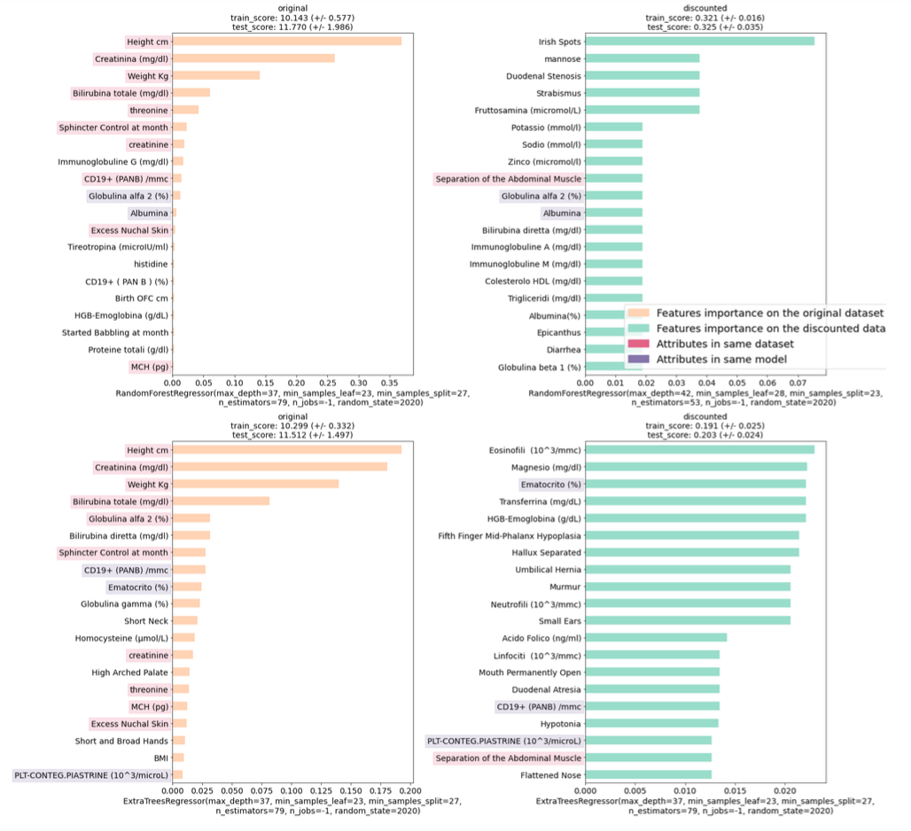

# Description
Remove age dependency in order to predict the equivalent age of children affected by down syndrome

# Results

Interesting attributes:
>    - **Strabismus** and **separation of the abdominal muscle** [[1]]
>    - **Mouth permanently open** [[2]] [[4]] (*A tongue that tends to stick out of the mouth* and *Poor muscle tone or loose joints*) 
>    - **Fifth Finger Mid-Phalanx Hypoplasia** [[3]]
>    - **Small ears** [[4]]

[1] [2] :*Bruce Buehler MD - Chair of Pediatrics UNMC - Director of the Munroe Meyer Institute for Genetics and Rehabilitation*

[3]:*Sonographic demonstration of hypoplasia of the middle phalanx of the fifth digit: a finding associated with Down syndrome*

[4]:*Centers for Disease Control and Prevention*

[1]:https://www.unmc.edu/media/mmi/09Symposium/BuehlerSymposium09.pdf#page=12 
[2]:https://www.unmc.edu/media/mmi/09Symposium/BuehlerSymposium09.pdf#page=13
[3]:https://pubmed.ncbi.nlm.nih.gov/2969190/ 
[4]:https://www.cdc.gov/ncbddd/birthdefects/downsyndrome.html
# License

- No license in the original repository
- GPLv3 in this repository~~~~

## Project for AI in Industry (LIA) @ UniBo
